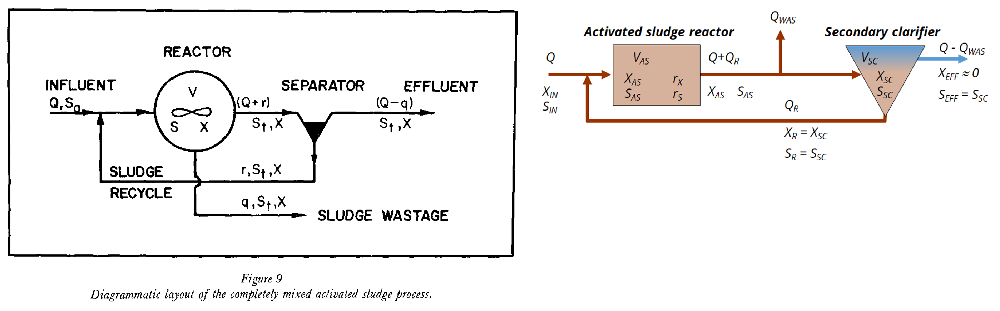
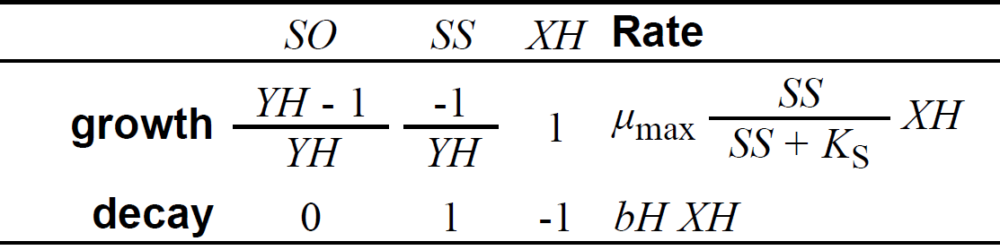

```{css, echo = FALSE}
.shiny-frame{height: 2000px;}
```  

```{r, echo=FALSE, message=FALSE}
library(deSolve)
library(readxl)
library(shinyjs)

# Markus Ahnert, Technische Universität Dresden, Institut für Siedlungs- und Industriewasserwirtschaft
# markus.ahnert@tu-dresden.de

# =======
# Model A
# =======
# direct growth on readily biodegradable substrate

# Description:
# Evolution of activated sludge model based on experiments and model development by Ekama and Marais 
# (1978) as published by Gujer and Henze (1991)

```
  
```{r, echo=FALSE, message=FALSE}
# zentral für die gesamte App
plot_labels_all <- c(
  "SS_AS"       = "Biodegradable substrate SS",
  "XBH_AS"      = "Heterotrophic biomass XBH",
  "OUR.SS_AS"   = "Respiration rate OUR",
  "SNH_AS"      = "Ammonia nitrogen NH4-N",
  "SNO_AS"      = "Nitrate nitrogen NO3-N",
  "XS_AS"       = "Slowly degradable substrate XS",
  "XI_AS"       = "Particulate inert COD XI",
  "XBA_AS"      = "Autotrophic biomass XBA"
)

get_plot_labels <- function(columns) {
  # columns = Vektor interner Variablennamen, z.B. c("SS_AS","XBH_AS","OUR.SS_AS")
  plot_labels_all[columns]
}
```
  
  
Markus Ahnert, Technische Universität Dresden, Institut für Siedlungs- und Industriewasserwirtschaft\
[markus.ahnert\@tu-dresden.de](mailto:markus.ahnert@tu-dresden.de)
  
  
### Background
Activated sludge models were developed since 1960/70 at different research institutions. The Department of Civil Engineering, University of Cape Town, South Africa, played a major role in this.
It was there that key principles were developed that can be found today in the well-known activated sludge models.
A large number of laboratory experiments of different scales were carried out for this purpose.
The results of one of these experiments are used for the subsequent model development. The individual models are based on a publication by Gujer and Henze (1991), who developed these models step by step on the basis of the experiments. The original source in the form of a research report with the experiments by Ekama and Marais is no longer publicly available. However, the results were also published by the authors in specialist journals, which are accessible. The sources are listed below:
  
* Gujer, W., & Henze, M. (1991). Activated sludge modelling and simulation. Water Science and Technology, 23(4-6), 1011-1023.
* Ekama, G.A. and Marais, G.V.R. (1978) 'The dynamic behavior of the activated sludge process', Research Report No. W27, University of Cape Town, Dept. of Civil Eng. (3 Volumes). (not available)
* Marais, G.V.R., & Ekama, G.A. (1976). The activated sludge process part I-steady state behaviour. Water SA, 2(4), 163-200.
* Ekama, G.A., Marais, G.V.R. (1977). The activated sludge process part II-Dynamic behaviour. Water SA, 3(1), 18-52.
* Ekama, G.A., & Marais, G.V.R. (1979). Dynamic behavior of the activated sludge process. Journal Water Pollution Control Federation, 534-556.
  
The experiments were carried out in a lab scale reactor with a volume of 6.73 L and a secondary clarifier for solids separation. The system was operated in a cyclic mode with influent flow from 2 am to 2 pm. In the same time the waste activated sludge Q~WAS~ was withdrawn direct from the activated sludge reactor. The scheme can be found in figure 1 from the original publication and in a modified version for use in this context. The index AS represents the activated sludge reactor, SC the secondary clarifier.
The reactor was aerated to a sufficient oxygen concentration. Samples were taken from the effluent and from the extracted activated sludge. The respiration rate in the reactor was also measured as a key parameter. This serves as the main comparative variable for the subsequent model development. 

The influent has a COD concentration of 540 g m^-3^.

  

  
&NewLine; 
  
### Model description
As already described in another app, the mass transport for the model can be modeled via a mass balance of the aeration tank - secondary clarifier system. The differential equations contained therein can be used for this purpose. The individual process rates must now be integrated into the equations for the biological conversion processes. 
This involves fractionating the organic components of the influent or the biomass into different model fractions.
The first model version A contains the easily degradable substrate SS and the heterotrophic biomass in fraction XH. Oxygen is included in fraction SO to determine the respiration rate.

The complete COD from influent is assigned to model fraction S~S~. The influent contains no additional biomass. The biomass in the reactor originates from the  prior day.

&NewLine; 
  
&NewLine; 
  
{width=50%}
  
&NewLine; 
  
Two processes are defined:

* Growth of heterotrophic biomass: Biomass is formed by consuming oxygen and substrate.
* Lysis ( decay) of heterotrophic biomass: The dead biomass becomes available again as a substrate for degradation.  

When biomass grows, part of the substrate is used to generate energy. This is determined by the stoichiometric parameter YH (heterotrophic yield).
When the biomass decays, the COD released in the process is completely converted back into degradable substrate.

&NewLine; 

The following code shows the ODE function of the defined model. It includes

* dynamic flow rates (influent and WAS)
* actual states variables 
* calculation of process rates based on defined model in matrix 
* calculation of derivatives as combination of transport processes and reactions

This ODE function is solved for every time step depending on the selected parameters below.

&NewLine;

```{r ode_function}
# define ODE function
model_ode <- function(t, state, params, influentfcn, wasfcn) {
  with(as.list(c(state, params)), {
    # dynamic influent and WAS flow rate
    Q <- influentfcn(t)
    Q_WAS <- wasfcn(t)
    
    # state variables
    SO_AS <- state[1]; SO_SC <- state[2]; SS_AS <- state[3]; SS_SC <- state[4]; XBH_AS <- state[5]; XBH_SC <- state[6]

    # internal variables    
    Monod_SS <- SS_AS/(SS_AS+Ks_SS)

    # processrates
    r_SO <- - ((1-1/YH)*(muH*Monod_SS*XBH_AS)) # switch to positive with minus: SO = negative COD
    r_SS <- - 1/YH *     muH*Monod_SS*XBH_AS  + bBH*XBH_AS
    r_XBH <-             muH*Monod_SS*XBH_AS  - bBH*XBH_AS
        
    # ODE equations
    # SO oxygen - no transport (active calculation of aeration system) only change due to processes for OUR calculation
    dSO_AS <- r_SO
    dSO_SC <- 0
    
    # SS readily biodegradable substrate
    dSS_AS <- Q/V_AS*SS_in + Q_R/V_AS*SS_SC - (Q+Q_R)/V_AS*SS_AS + r_SS
    dSS_SC <- (Q+Q_R-Q_WAS)/V_SC*SS_AS - (Q+Q_R-Q_WAS)/V_SC*SS_SC

    # XBH heterotrophic biomass
    dXBH_AS <- Q/V_AS*XBH_in + Q_R/V_AS*XBH_SC - (Q+Q_R)/V_AS*XBH_AS + r_XBH
    dXBH_SC <- (Q+Q_R-Q_WAS)/V_SC*XBH_AS - (Q_R)/V_SC*XBH_SC

    # return derivatives and respiration rate OUR
    list(c(dSO_AS, dSO_SC, dSS_AS, dSS_SC, dXBH_AS, dXBH_SC),OUR=dSO_AS)
  })
}
```
  
  
### Model application
The Yield Y~H~ determines the oxygen consumption required for biomass growth. The growth rate µ~max~ determines the speed of growth. However, this is only the case with an unlimited supply of substrate.
The decay rate b~H~ and the sludge retention time SRT determine the biomass content X~BH~ in the reactor. This has a direct influence on the absolute growth of the biomass.
  
  
### Tasks

* Evaluate the quality of the model fit! Describe things that could be improved!
* Describe the change in oxygen uptake rate (respiration rate) OUR when Y~H~ is decreased or increased!
* When you increase the SRT what effect can be seen regarding the biomass content X~H~? Can you explain the reason?
* If the decay rate b~H~ is increased how does this effect the substrate concentration S~S~ in the effluent and the biomass X~H~ in the reactor? 
  
  

```{r shiny_bsp1, echo=FALSE}

# ===== start of definitions and initialization

# measured OUR data 
OUR<-read.csv("measured_OUR.csv", sep = ";")

shinyApp(
  
  ui = fluidPage(
    useShinyjs(),
    # Application title
    title="Parameters model A:",
    id = "form",
fluidRow(
  column(4,
         numericInput(inputId = "YH",
                      label = HTML("heterotrophic yield Y<sub>H</sub> [-]:"),
                      value = 0.67, min=0.00001, max=0.999999, step=0.1),
         numericInput(inputId = "mumax",
                      label = HTML("max. growth rate µ<sub>max</sub> [d<sup>-1</sup>]:"),
                      value = 4, min=0, step=0.2),
  ),
  column(4, 
         numericInput(inputId = "Ks",
                      label = HTML("half saturation constant K<sub>s</sub> [g m<sup>-3</sup>]:"),
                      value = 5, min=0),
         numericInput(inputId = "bH",
                      label = HTML("decay rate b<sub>H</sub> [d-1]:"),
                      value = 0.6, min=0, step=0.1),
  ),
  column(4,
         numericInput(inputId = "SRT",
                      label = HTML("sludge retention time SRT [d]:"),
                      value = 2.5, min=0),

         # Leeres Label für Ausrichtung
         div(style = "margin-top: 40px;",
             actionButton("resetAll", "Reset all")
            )
  )
  
),
fluidRow(
    plotOutput("ConcPlot2")
  ),

fluidRow(
    plotOutput("ConcPlot1")
  )  
),  
  server = function(input, output) {

observeEvent(input$resetAll, {
  reset("form")
})
    
plots <- reactive({

# definition of system: initial states, parameters, boundary conditions

# set up parameters in a list
# first line: system description
# second line: influent conditions
# third and following lines: model parameters and stoichiometric coefficients

params = c(Q_R = 18/1000*0.75, V_AS = 6.73/1000, V_SC = 0.001/1000,
           SO_in = 0, SS_in = 540, XBH_in = 0,
           Ks_SS = input$Ks, YH = input$YH, bBH = input$bH, muH = input$mumax)

# initial concentrations
state_0 = c(SO_AS = 0, SO_SC = 0, SS_AS = 0, SS_SC = 0, XBH_AS = 100, XBH_SC = 200) 

t_start = 0 # start time
t_end = 50 # end time
t_points = seq(t_start, t_end, by = 1/24/4) # time points for solution

# daily cycle events: influent and sludge wastage only from 2 am to 2 pm
# influent flow rate 18 L/d - 36 L/d in 12 hours
influentdata <- data.frame(
  time = c(0, 2/24, 14/24),   # 1 entfernt
  value = c(0, 2*18/1000, 0)
)

# sludge retention time (sludge age) of 2.5 days withdrawn from AS reactor in 12 hours
wasdata <- data.frame(
  time = c(0, 2/24, 14/24),
  value = c(0,2*6.73/(1000*input$SRT),0)
)

# daily repetition
days_to_repeat <- 100

# definition of complete dataset 
influentdata_extended <- do.call(rbind, lapply(0:(days_to_repeat - 1), function(day) {
  data.frame(
    time  = influentdata$time + day,
    value = influentdata$value
  )
}))

wasdata_extended <- do.call(rbind, lapply(0:(days_to_repeat - 1), function(day) {
  data.frame(
    time = wasdata$time + day, 
    value = wasdata$value)}))

# function for influent, Q_WAS
influentfun <- approxfun(influentdata_extended$time, influentdata_extended$value, method = "constant", rule = 2)
wasfun <- approxfun(wasdata_extended$time, wasdata_extended$value, method = "constant", rule = 2)

# ===== end of definitions and initialisation

# solve ODE
out = ode(y = state_0, times = t_points, func = model_ode, parms = params, influentfcn=influentfun, wasfcn=wasfun)
      
    # Rückgabe der Ergebnisse an Plots
    list(out=out)
})

    output$ConcPlot1 <- renderPlot({
      par(mfrow = c(1,1))
      par(mar = c(5,5,5,5) )
      out <- plots()$out
      df <- as.data.frame(out)
      ylimits <- list(c(0, max(df$SS_AS[df$time >= 49])), 
                c(min(df$XBH_AS[df$time >= 49]), max(df$XBH_AS[df$time >= 49])))

      columns_plot <- c("SS_AS","XBH_AS")
      
      labels_plot <- get_plot_labels(columns_plot)

      plot(out, which = columns_plot,    # interne Namen
               main  = labels_plot,             # Anzeige-Titel 
              ylab = expression("Concentration [g m"^"-3"*"]"),xlim=c(49,50),
              ylim=ylimits,obs=list(as.data.frame(OUR)),
              cex.lab=1.5, cex.axis=1.5, cex.main=1.5, cex.sub=1.5)

            
    })

    output$ConcPlot2 <- renderPlot({
      par(mfrow = c(1,1))
      par(mar = c(5,5,5,5) )
      out <- plots()$out
      df <- as.data.frame(out)
      ylimits <- list(c(0, max(df$OUR.SS_AS[df$time >= 49],OUR$OUR.SS_AS)))

      columns_plot <- c("OUR.SS_AS")
      
      labels_plot <- get_plot_labels(columns_plot)

      plot(out, which = columns_plot,    # interne Namen
               main  = labels_plot,             # Anzeige-Titel 
              ylab = expression("Concentration [g m"^"-3"*"]"),xlim=c(49,50),
              ylim=ylimits,obs=list(as.data.frame(OUR)),
              cex.lab=1.5, cex.axis=1.5, cex.main=1.5, cex.sub=1.5)

      
    })
        

  }
  
  
)
```
