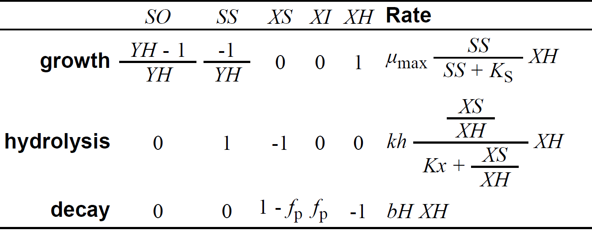

```{css, echo = FALSE}
.shiny-frame{height: 2000px;}
```  

```{r, echo=FALSE, message=FALSE}
library(deSolve)
library(readxl)
library(shinyjs)

# Markus Ahnert, Technische Universität Dresden, Institut für Siedlungs- und Industriewasserwirtschaft
# markus.ahnert@tu-dresden.de

# =======
# Model C
# =======
# direct growth on readily biodegradable substrate, hydrolysis of slowly biodegradable substrate
# additional inert particulate fraction XI for correct sludge production

# Description:
# Evolution of activated sludge model based on experiments and model development by Ekama and Marais (1978)
# as published by Gujer and Henze (1991)
```
  
  
  
Markus Ahnert, Technische Universität Dresden, Institut für Siedlungs- und Industriewasserwirtschaft\
[markus.ahnert\@tu-dresden.de](mailto:markus.ahnert@tu-dresden.de)
  
  
This App is the follow up of the model version B.  
  
  
### Model description
In model version B the fit of OUR between measurement and model result was very good. Unfortunately, however, the activated sludge concentration was far too low. Therefore, an additional fraction is required that enables a realistic representation of sludge production.
When the biomass dies, part of it is shifted to this new fraction so that this fraction can accumulate in the system over time. The parameter f~P~ influences this fraction.


  
{width=50%}
  
  
### Model application
Depending on the parameter f~P~ the sludge mass in the system is influenced. This has only a minor influence on the OUR. The part of XH that is converted into the fraction XI is no longer affected by degradation or growth processes.
  
  
### Tasks

* ###


```{r shiny_bsp1, echo=FALSE}

# ===== start of definitions and initialization

# measured OUR data 
OUR<-read_excel("measured_OUR.xlsx","Tabelle1")

# define ODE function
model_ode <- function(t, state, params, influentfcn, wasfcn) {
  with(as.list(c(state, params)), {

    # dynamic influent and WAS flow rate
    Q <- influentfcn(t)
    Q_WAS <- wasfcn(t)
    
    # state variables
    SO_AS <- state[1]
    SO_SC <- state[2]
    
    SS_AS <- state[3]
    SS_SC <- state[4]

    XS_AS <- state[5]
    XS_SC <- state[6]

    XI_AS <- state[7]
    XI_SC <- state[8]
    
    XBH_AS <- state[9]
    XBH_SC <- state[10]
    
    # internal variables    
    Monod_SS <- SS_AS/(SS_AS+Ks_SS)
    Monod_XS <- (XS_AS/XBH_AS)/(Kx+XS_AS/XBH_AS)

    # processrates
    
    r_SO <- - ((1-1/YH)*(muH*Monod_SS*XBH_AS)) # switch to positive with minus: SO = negative COD
    r_SS <- - 1/YH *     muH*Monod_SS*XBH_AS  + kh*Monod_XS*XBH_AS
    r_XBH <-             muH*Monod_SS*XBH_AS  - bBH*XBH_AS
    r_XS <-              -kh*Monod_XS*XBH_AS  + bBH*XBH_AS*(1-fP)
    r_XI <-                                   + bBH*XBH_AS*fP
    
    # ODEs

    # SO oxygen - no transport only change due to processes for OUR calculation
    dSO_AS <- r_SO
    dSO_SC <- 0
    
    # SS readily biodegradable substrate
    dSS_AS <- Q/V_AS*SS_in + Q_R/V_AS*SS_SC - (Q+Q_R)/V_AS*SS_AS + r_SS
    dSS_SC <- (Q+Q_R-Q_WAS)/V_SC*SS_AS - (Q+Q_R-Q_WAS)/V_SC*SS_SC

    # XS slowly biodegradable substrate
    dXS_AS <- Q/V_AS*XS_in + Q_R/V_AS*XS_SC - (Q+Q_R)/V_AS*XS_AS + r_XS
    dXS_SC <- (Q+Q_R-Q_WAS)/V_SC*XS_AS - (Q_R)/V_SC*XS_SC

    # XI inert particulate residues
    dXI_AS <- Q/V_AS*XI_in + Q_R/V_AS*XI_SC - (Q+Q_R)/V_AS*XI_AS + r_XI
    dXI_SC <- (Q+Q_R-Q_WAS)/V_SC*XI_AS - (Q_R)/V_SC*XI_SC
        
    # XBH heterotrophic biomass
    dXBH_AS <- Q/V_AS*XBH_in + Q_R/V_AS*XBH_SC - (Q+Q_R)/V_AS*XBH_AS + r_XBH
    dXBH_SC <- (Q+Q_R-Q_WAS)/V_SC*XBH_AS - (Q_R)/V_SC*XBH_SC
    
    
    # return derivatives
    list(c(dSO_AS, dSO_SC, dSS_AS, dSS_SC, dXS_AS, dXS_SC, dXI_AS, dXI_SC, dXBH_AS, dXBH_SC),OUR=dSO_AS)
  })
}


shinyApp(
  
  ui = fluidPage(
    useShinyjs(),
    # Application title
    title="Parameters model C:",
    id = "form",

fluidRow(
  column(4,
         numericInput(inputId = "YH",
                      label = HTML("heterotrophic yield YH [-]:"),
                      value = 0.67, min=0.00001, max=0.999999, step=0.1),
         numericInput(inputId = "mumax",
                      label = HTML("max. growth rate mumax [d-1]:"),
                      value = 4, min=0, step=0.2),
         numericInput(inputId = "Ks",
                      label = HTML("half saturation constant Ks [g m-3]:"),
                      value = 5, min=0),
  ),
  column(4, 
         numericInput(inputId = "bH",
                      label = HTML("decay rate bH [d-1]:"),
                      value = 0.6, min=0, step=0.1),
         numericInput(inputId = "kh",
                      label = HTML("max. hydrolysis rate kh [d-1]:"),
                      value = 2, min=0, step=0.2),
         numericInput(inputId = "Kx",
                      label = HTML("half saturation value Kx [-]:"),
                      value = 0.04, min=0, step=0.01),
  ),
  column(4,
         numericInput(inputId = "fP",
                      label = HTML("inert fraction of dead biomass fP [-]:"),
                      value = 0.08, min=0, max=1, step=0.05),
         numericInput(inputId = "SRT",
                      label = HTML("sludge retention time SRT [d]:"),
                      value = 2.5, min=0),
         
         actionButton("resetAll", "Reset all"),         
  ),
  plotOutput("ConcPlot1"),
  
)

),  
  server = function(input, output) {

observeEvent(input$resetAll, {
  reset("form")
})
    
plots <- reactive({

# definition of system: initial states, parameters, boundary conditions

# set up parameters in a list
# first line: system description
# second line: influent conditions
# third and following lines: model parameters and stoichiometric coefficients

params = c(Q_R = 18/1000, V_AS = 6.73/1000, V_SC = 0.001/1000,
           SO_in = 0, SS_in = 110, XS_in = 330, XI_in=100, XBH_in = 0,
           Ks_SS = input$Ks, YH = input$YH, bBH = input$bH, muH = input$mumax,
           Kx=input$Kx, kh=input$kh, fP=input$fP)

# initial concentrations
state_0 = c(SO_AS = 0, SO_SC = 0, SS_AS = 0, SS_SC = 0, XS_AS = 0, XS_SC = 0, XI_AS = 0, XI_SC = 0, XBH_AS = 100, XBH_SC = 200) 

t_start = 0 # start time
t_end = 50 # end time
t_points = seq(t_start, t_end, by = 1/24/4) # time points for solution

# daily cycle events: influent and sludge wastage only from 2 am to 2 pm
# influent flow rate 18 L/d - 36 L/d in 12 hours
# influent flow rate 18 L/d - 36 L/d in 12 hours
influentdata <- data.frame(
  time = c(0, 2/24, 14/24),   # 1 entfernt
  value = c(0, 2*18/1000, 0)
)

# sludge retention time (sludge age) of 2.5 days withdrawn from AS reactor in 12 hours
wasdata <- data.frame(
  time = c(0, 2/24, 14/24),
  value = c(0,2*6.73/(1000*input$SRT),0)
)

# daily repetition
days_to_repeat <- 100

# definition of complete dataset 
influentdata_extended <- do.call(rbind, lapply(0:(days_to_repeat - 1), function(day) {
  data.frame(
    time  = influentdata$time + day,
    value = influentdata$value
  )
}))

wasdata_extended <- do.call(rbind, lapply(0:(days_to_repeat - 1), function(day) {
  data.frame(
    time = wasdata$time + day, 
    value = wasdata$value)}))

# function for influent, Q_WAS
influentfun <- approxfun(influentdata_extended$time, influentdata_extended$value, method = "constant", rule = 2)
wasfun <- approxfun(wasdata_extended$time, wasdata_extended$value, method = "constant", rule = 2)

# ===== end of definitions and initialisation

# solve ODE
out = ode(y = state_0, times = t_points, func = model_ode, parms = params, influentfcn=influentfun, wasfcn=wasfun)
      
# plot some results
df <- as.data.frame(out)
ylimits <- list(c(0, max(df$SS_AS[df$time >= 49])), 
                c(0, max(df$XS_AS[df$time >= 49])), 
                c(min(df$XI_AS[df$time >= 49]), max(df$XI_AS[df$time >= 49])), 
                c(min(df$XBH_AS[df$time >= 49]), max(df$XBH_AS[df$time >= 49])),
                c(0, max(df$OUR.SS_AS[df$time >= 49],OUR$OUR.SS_AS)))

par(mar=c(5,5,5,5))
plot1 <-plot(out, which = c("SS_AS","XS_AS","XI_AS","XBH_AS","OUR.SS_AS"),xlab = "Time [d]", 
             ylab = expression("Concentration [g m"^"-3"*"]")
             ,xlim=c(49,50), ylim=ylimits,obs=list(as.data.frame(OUR)),
              cex.lab=1.5, cex.axis=1.5, cex.main=1.5, cex.sub=1.5)             

    # Rückgabe der Plots als Liste
    list(plot1 = plot1)
})

    output$ConcPlot1 <- renderPlot({
      plots()$plot1
    })
  }
  
  
)
```
