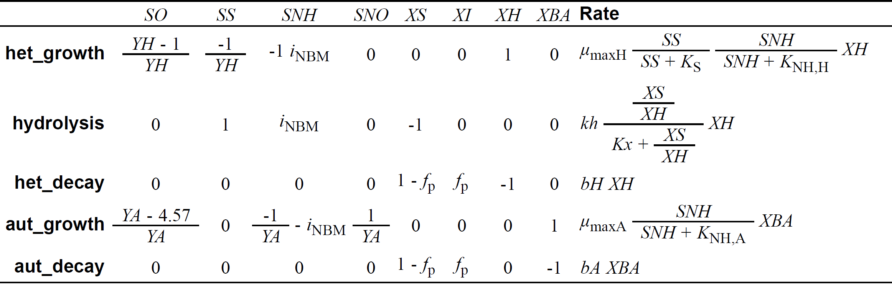

```{css, echo = FALSE}
.shiny-frame{height: 2000px;}
```  

```{r, echo=FALSE, message=FALSE}
library(deSolve)
library(readxl)
library(shinyjs)

# Markus Ahnert, Technische Universität Dresden, Institut für Siedlungs- und Industriewasserwirtschaft
# markus.ahnert@tu-dresden.de

# =======
# Model D
# =======
# direct growth on readily biodegradable substrate, hydrolysis of slowly biodegradable substrate
# additional inert particulate fraction XI for correct sludge production
# nitrification with autotrophic biomass

# Description:
# Evolution of activated sludge model based on experiments and model development by Ekama and Marais (1978)
# as published by Gujer and Henze (1991)
```
  
  
  
Markus Ahnert, Technische Universität Dresden, Institut für Siedlungs- und Industriewasserwirtschaft\
[markus.ahnert\@tu-dresden.de](mailto:markus.ahnert@tu-dresden.de)
  
  
This App is the follow up of the model version C and the last version of this model development course.  
  
  
### Model description
The adjustment in model version C led to a reduced respiration rate. In the previous model versions, only organic carbon degradation was taken into account. However, nitrate was also measured in the reactor, so that nitrification must be assumed as an additional oxygen-consuming process. The model component X~A~ representing autotrophic nitrifying biomass is added to model D. The necessary components S~NH~ and S~NO~ as well as the growth and decay of the nitrifiers were also added.


  
{width=50%}
  
  
### Model description
Nitrifiers X~A~ grow directly on substrate S~NH~. They produce nitrate S~NO~ while using inorganic carbon from dissolved CO~2~ for build-up of cell mass (not integrated in the model). The decay process of nitrifiers is similar to heterotrophic biomass. Ammonia S~NH~ is also used for cell mass build-up in both growth processes because of the nitrogen content of bacterial biomass (e.g. proteins). 
Stoichiometric oxygen demand for nitrification is 4.57 g O~2~ g^-1^ N oxidized that can be found as factor in model matrix.
  
  
### Model application and outlook
Now the model calculation shows a quite good model fit. For a better fit some numerical methods for parameter estimation would be helpful due to the large number of involved parameters. First a sensivite analysis should be performed to identify the relevant parameter for minimisation of parameter optimisation calculation time.
The model complexity leads in general to long calculation times within this app. A compilation of the ODE code instead of a numerical solution based on an interpreter as in the actual stage would speed up the numerical solution. At this stage of model complexity the use of a special software for solution of activated sludge models like [Simba#](https://www.ifak.eu/en/produkte/simba), [Sumo](https://dynamita.com/) or [Biowin](https://envirosim.com/) would be more suitable.
The model itself needs also some further improvement as it was done in models ASM1-3 and other developments based on these core ASM. 
  
  


```{r shiny_bsp1, echo=FALSE}

# ===== start of definitions and initialization

# measured OUR data 
OUR<-read.csv("measured_OUR.csv", sep = ";")
SNOmeas<-read.csv("measured_nitrate.csv", sep = ";")

# define ODE function
model_ode <- function(t, state, params, influentfcn, wasfcn) {
  with(as.list(c(state, params)), {

    # dynamic influent and WAS flow rate
    Q <- influentfcn(t)
    Q_WAS <- wasfcn(t)
    
    # state variables
    SO_AS <- state[1]
    SO_SC <- state[2]
    
    SS_AS <- state[3]
    SS_SC <- state[4]

    SNH_AS <- state[5]
    SNH_SC <- state[6]
    
    SNO_AS <- state[7]
    SNO_SC <- state[8]

    XS_AS <- state[9]
    XS_SC <- state[10]

    XI_AS <- state[11]
    XI_SC <- state[12]
    
    XBH_AS <- state[13]
    XBH_SC <- state[14]

    XBA_AS <- state[15]
    XBA_SC <- state[16]
        
    # internal variables    
    Monod_SS <- SS_AS/(SS_AS+Ks_SS)
    Monod_XS <- (XS_AS/XBH_AS)/(Kx+XS_AS/XBH_AS)
    Monod_SNHA <- (SNH_AS)/(K_NHA+SNH_AS)
    Monod_SNHH <- (SNH_AS)/(K_NHH+SNH_AS)

    # processrates
    
    r_SO <- - ((1-1/YH)*(muH*Monod_SS*Monod_SNHH*XBH_AS)+(YA-4.57)/YA*muA*Monod_SNHA*XBA_AS) 
    # switch to positive with minus: SO = negative COD
    r_SS <- - 1/YH *     muH*Monod_SS*Monod_SNHH*XBH_AS  + kh*Monod_XS*XBH_AS
    r_SNH <- - (1/YA + iNBM)*muA*Monod_SNHA*XBA_AS - iNBM*muH*Monod_SS*Monod_SNHH*XBH_AS +iNBM*kh*Monod_XS*XBH_AS
    r_SNO <-   (1/YA)*muA*Monod_SNHA*XBA_AS
    r_XBH <-             muH*Monod_SS*Monod_SNHH*XBH_AS  - bBH*XBH_AS
    r_XS <-              -kh*Monod_XS*XBH_AS  + bBH*XBH_AS*(1-fP) + bBA*XBA_AS*(1-fP)
    r_XI <-                                   + bBH*XBH_AS*fP     + bBA*XBA_AS*fP
    r_XBA <-             muA*Monod_SNHA*XBA_AS - bBA*XBA_AS
    
    # ODEs

    # SO oxygen - no transport only change due to processes for OUR calculation
    dSO_AS <- r_SO
    dSO_SC <- 0
    
    # SS readily biodegradable substrate
    dSS_AS <- Q/V_AS*SS_in + Q_R/V_AS*SS_SC - (Q+Q_R)/V_AS*SS_AS + r_SS
    dSS_SC <- (Q+Q_R-Q_WAS)/V_SC*SS_AS - (Q+Q_R-Q_WAS)/V_SC*SS_SC

    # SNH ammonia nitrogen
    dSNH_AS <- Q/V_AS*SNH_in + Q_R/V_AS*SNH_SC - (Q+Q_R)/V_AS*SNH_AS + r_SNH
    dSNH_SC <- (Q+Q_R-Q_WAS)/V_SC*SNH_AS - (Q+Q_R-Q_WAS)/V_SC*SNH_SC

    # SNO nitrate nitrogen
    dSNO_AS <- Q/V_AS*SNO_in + Q_R/V_AS*SNO_SC - (Q+Q_R)/V_AS*SNO_AS + r_SNO
    dSNO_SC <- (Q+Q_R-Q_WAS)/V_SC*SNO_AS - (Q+Q_R-Q_WAS)/V_SC*SNO_SC
        
    # XS slowly biodegradable substrate
    dXS_AS <- Q/V_AS*XS_in + Q_R/V_AS*XS_SC - (Q+Q_R)/V_AS*XS_AS + r_XS
    dXS_SC <- (Q+Q_R-Q_WAS)/V_SC*XS_AS - (Q_R)/V_SC*XS_SC

    # XI inert particulate residues
    dXI_AS <- Q/V_AS*XI_in + Q_R/V_AS*XI_SC - (Q+Q_R)/V_AS*XI_AS + r_XI
    dXI_SC <- (Q+Q_R-Q_WAS)/V_SC*XI_AS - (Q_R)/V_SC*XI_SC
        
    # XBH heterotrophic biomass
    dXBH_AS <- Q/V_AS*XBH_in + Q_R/V_AS*XBH_SC - (Q+Q_R)/V_AS*XBH_AS + r_XBH
    dXBH_SC <- (Q+Q_R-Q_WAS)/V_SC*XBH_AS - (Q_R)/V_SC*XBH_SC
    
    # XBA autotrophic biomass
    dXBA_AS <- Q/V_AS*XBA_in + Q_R/V_AS*XBA_SC - (Q+Q_R)/V_AS*XBA_AS + r_XBA
    dXBA_SC <- (Q+Q_R-Q_WAS)/V_SC*XBA_AS - (Q_R)/V_SC*XBA_SC
    
    # return derivatives
    list(c(dSO_AS, dSO_SC, dSS_AS, dSS_SC, dSNH_AS, dSNH_SC, dSNO_AS, dSNO_SC, 
           dXS_AS, dXS_SC, dXI_AS, dXI_SC, dXBH_AS, dXBH_SC, dXBA_AS, dXBA_SC),OUR=dSO_AS)
  })
}


shinyApp(
  
  ui = fluidPage(
    useShinyjs(),
    # Application title
    title="Parameters model D:",
    id = "form",

fluidRow(
  column(4,
         numericInput(inputId = "YH",
                      label = HTML("heterotrophic yield Y<sub>H</sub> [-]:"),
                      value = 0.67, min=0.00001, max=0.999999, step=0.1),
         numericInput(inputId = "mumaxH",
                      label = HTML("max. het. growth rate µ<sub>maxH</sub> [d<sup>-1</sup>]:"),
                      value = 4, min=0, step=0.2),
         numericInput(inputId = "Ks",
                      label = HTML("half saturation constant K<sub>s</sub> [g m<sup>-3</sup>]:"),
                      value = 5, min=0),
         numericInput(inputId = "bH",
                      label = HTML("het. decay rate b<sub>H</sub> [d<sup>-1</sup>]:"),
                      value = 0.6, min=0, step=0.1),
         numericInput(inputId = "fP",
                      label = HTML("inert fraction of dead biomass f<sub>P</sub> [-]:"),
                      value = 0.08, min=0, max=1, step=0.05),
  ),
  column(4, 
         numericInput(inputId = "kh",
                      label = HTML("max. hydrolysis rate k<sub>h</sub> [d<sup>-1</sup>]:"),
                      value = 2, min=0, step=0.2),
         numericInput(inputId = "Kx",
                      label = HTML("half saturation value K<sub>x</sub> [-]:"),
                      value = 0.04, min=0, step=0.01),
         numericInput(inputId = "SRT",
                      label = HTML("sludge retention time SRT [d]:"),
                      value = 2.5, min=0),
         numericInput(inputId = "iNBM",
                      label = HTML("N content of part. COD [g N g<sup>-1</sup> COD]:"),
                      value = 0.08, min=0, max=1, step=0.01),
         # Leeres Label für Ausrichtung
         div(style = "margin-top: 40px;",
             actionButton("resetAll", "Reset all")
            )
  ),
  column(4,
         numericInput(inputId = "YA",
                      label = HTML("autotrophic yield Y<sub>A</sub> [-]:"),
                      value = 0.24, min=0, max=1, step=0.05),
         numericInput(inputId = "mumaxA",
                      label = HTML("max. aut. growth rate µ<sub>maxA</sub> [d<sup>-1</sup>]:"),
                      value = 1, min=0, step=0.1),
         numericInput(inputId = "bA",
                      label = HTML("aut. decay rate b<sub>A</sub> [d<sup>-1</sup>]:"),
                      value = 0.1, min=0, max=1, step=0.05),
         numericInput(inputId = "K_NHH",
                      label = HTML("half sat. constant K<sub>NHH</sub> [g m<sup>-3</sup>]:"),
                      value = 0.1, min=0, step=0.1),
         numericInput(inputId = "K_NHA",
                      label = HTML("half sat. constant K<sub>NHA</sub> [g m<sup>-3</sup>]:"),
                      value = 1, min=0),
         
  )
  
),
fluidRow(
    plotOutput("ConcPlot1")
  ),

  fluidRow(
    plotOutput("ConcPlot2")
  ) 

),  
  server = function(input, output) {

observeEvent(input$resetAll, {
  reset("form")
})
    
plots <- reactive({

# definition of system: initial states, parameters, boundary conditions

# set up parameters in a list
# first line: system description
# second line: influent conditions
# third and following lines: model parameters and stoichiometric coefficients

params = c(Q_R = 18/1000, V_AS = 6.73/1000, V_SC = 0.001/1000,
           SO_in = 0, SS_in = 110, SNH_in=10, SNO_in=0, XS_in = 330, XI_in=100, XBH_in = 0, XBA_in=0,
           Ks_SS = input$Ks, YH = input$YH, bBH = input$bH, muH = input$mumaxH,
           Kx=input$Kx, kh=input$kh, fP=input$fP, iNBM=input$iNBM, YA=input$YA, 
           muA=input$mumaxA, bBA=input$bA, K_NHA=input$K_NHA, K_NHH=input$K_NHH)

# initial concentrations
state_0 = c(SO_AS = 0, SO_SC = 0, SS_AS = 0, SS_SC = 0, SNH_AS = 0, SNH_SC = 0, SNO_AS = 0, SNO_SC = 0,
            XS_AS = 0, XS_SC = 0, XI_AS = 0, XI_SC = 0, XBH_AS = 100, XBH_SC = 200, XBA_AS = 1, XBA_SC = 2) 

t_start = 0 # start time
t_end = 20 # end time
t_points = seq(t_start, t_end, by = 1/24/4) # time points for solution

# daily cycle events: influent and sludge wastage only from 2 am to 2 pm
# influent flow rate 18 L/d - 36 L/d in 12 hours
# influent flow rate 18 L/d - 36 L/d in 12 hours
influentdata <- data.frame(
  time = c(0, 2/24, 14/24),   # 1 entfernt
  value = c(0, 2*18/1000, 0)
)

# sludge retention time (sludge age) of 2.5 days withdrawn from AS reactor in 12 hours
wasdata <- data.frame(
  time = c(0, 2/24, 14/24),
  value = c(0,2*6.73/(1000*input$SRT),0)
)

# daily repetition
days_to_repeat <- 100

# definition of complete dataset 
influentdata_extended <- do.call(rbind, lapply(0:(days_to_repeat - 1), function(day) {
  data.frame(
    time  = influentdata$time + day,
    value = influentdata$value
  )
}))

wasdata_extended <- do.call(rbind, lapply(0:(days_to_repeat - 1), function(day) {
  data.frame(
    time = wasdata$time + day, 
    value = wasdata$value)}))

# function for influent, Q_WAS
influentfun <- approxfun(influentdata_extended$time, influentdata_extended$value, method = "constant", rule = 2)
wasfun <- approxfun(wasdata_extended$time, wasdata_extended$value, method = "constant", rule = 2)

# ===== end of definitions and initialisation

# solve ODE
out = ode(y = state_0, times = t_points, func = model_ode, parms = params, influentfcn=influentfun, wasfcn=wasfun)
      
# plot some results

    # Rückgabe der Plots als Liste
    list(out=out)
})

    output$ConcPlot2 <- renderPlot({
      out<-plots()$out
      par(mfrow = c(1,1))
      par(mar = c(5,5,5,5) )

      df <- as.data.frame(out)
      ylimits <- list(c(0, max(df$SS_AS[df$time >= 19])), 
                c(0, max(df$SNH_AS[df$time >= 19])), 
                c(0, max(df$XS_AS[df$time >= 19])), 
                c(min(df$XI_AS[df$time >= 19]), max(df$XI_AS[df$time >= 19])), 
                c(min(df$XBH_AS[df$time >= 19]), max(df$XBH_AS[df$time >= 19])),
                c(min(df$XBA_AS[df$time >= 19]), max(df$XBA_AS[df$time >= 19])))


      plot(out, which = c("SS_AS","SNH_AS","XS_AS","XI_AS","XBH_AS","XBA_AS"),xlab = "Time [d]",                         ylab = expression("Concentration [g m"^"-3"*"]")
             ,xlim=c(19,20), ylim=ylimits,obs=list(as.data.frame(OUR),as.data.frame(SNOmeas)),
              cex.lab=1.5, cex.axis=1.5, cex.main=1.5, cex.sub=1.5)             

      
      })
    
    output$ConcPlot1 <- renderPlot({
      out<-plots()$out
      par(mfrow = c(1,1))
      par(mar = c(5,5,5,5) )

      df <- as.data.frame(out)
      ylimits <- list(c(0, max(df$SNO_AS[df$time >= 19])), 
                c(0, max(df$OUR.SS_AS[df$time >= 19],OUR$OUR.SS_AS)))


      plot(out, which = c("SNO_AS","OUR.SS_AS"),xlab = "Time [d]",              
           ylab = expression("Concentration [g m"^"-3"*"]")
             ,xlim=c(19,20), ylim=ylimits,obs=list(as.data.frame(OUR),as.data.frame(SNOmeas)),
              cex.lab=1.5, cex.axis=1.5, cex.main=1.5, cex.sub=1.5)             
      
    })
    
  }

#mehrere Plots einfügen siehe ggf. hier https://stackoverflow.com/questions/34384907/how-can-put-multiple-plots-side-by-side-in-shiny-r  
  
)
```
