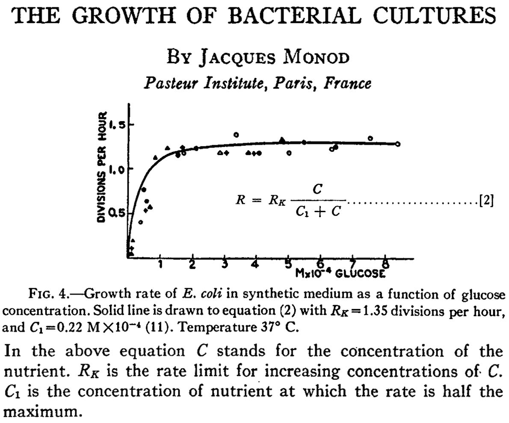

```{css, echo = FALSE}
.shiny-frame{height: 2000px;}
```  

```{r, echo=FALSE, message=FALSE}
library(shinyjs)

# Example for Monod function calculation

# Markus Ahnert, Technische Universität Dresden, Institut für Siedlungs- und Industriewasserwirtschaft
# markus.ahnert@tu-dresden.de

```
  
  
  
Markus Ahnert, Technische Universität Dresden, Institut für Siedlungs- und Industriewasserwirtschaft\
[markus.ahnert\@tu-dresden.de](mailto:markus.ahnert@tu-dresden.de)
  
  
### Description
Jacques Monod discovered the relation between substrate concentration and speed of microbial growth. It is not linear but reaches a maximum growth rate as can be seen from the original experimental data.

Monod, Jacques (1949). THE GROWTH OF BACTERIAL CULTURES. Annual Review of Microbiology, 3(1), 371-394.

  
{width=50%}
  
&NewLine;  
  
For a mathematical description an equation with a maximum growth rate (rate limit regarding figure above) and a quotient with a parameter called half saturation coefficient can be used. The name of this parameter is derived from the relation that the real growth rate is 50 % of the maximum when the substrate concentration has a value of  half the saturation concentration.  
  
  
### Application
You can use the input field to modify the parameters and see the effect of maximum growth rate and half saturation concentration on the actual growth rate.
  
  
```{r shiny_bsp1, echo=FALSE}

# UTF Codes für griechische Symbole https://en.wikipedia.org/wiki/Greek_script_in_Unicode

shinyApp(
  
  ui = fluidPage(
    useShinyjs(),
    # Application title
    title="Monod function testing:",
    id = "form",
fluidRow(
  column(4,
         numericInput(inputId = "mumax1",
                      label = HTML("max. growth rate 1 [g m<sup>-3</sup> d<sup>-1</sup>]:"),
                      value = 10, min=0),
         numericInput(inputId = "Ks1",
                      label = HTML("half saturation conc. 1 [g m<sup>-3</sup>]:"),
                      value = 15, min=0),
  ),
  column(4, offset=3, 
         numericInput(inputId = "mumax2",
                      label = HTML("max. growth rate 2 [g m<sup>-3</sup> d<sup>-1</sup>]:"),
                      value = 5, min=0),
         numericInput(inputId = "Ks2",
                      label = HTML("half saturation conc. 2 [g m<sup>-3</sup>]:"),
                      value = 2, min=0),
          actionButton("resetAll", "Reset all"),
  ),
  plotOutput("ConcPlot1"),
  
)

),  
  server = function(input, output) {

observeEvent(input$resetAll, {
  reset("form")
})
    
plots <- reactive({

s_start = 0 # start concentration  substrate
s_end = 50 # end concentration substrate
s_points = seq(s_start, s_end, by = 0.5) # points for solution

#calculations
out1 <- input$mumax1*s_points/(s_points+input$Ks1)
out2 <- input$mumax2*s_points/(s_points+input$Ks2)

# show results
# Create an empty plot
par(mar=c(5,5,5,5))

plot1 <-plot(out1, type = "n",  
     xlab = expression("Concentration [g m"^"-3"*"]"), 
     ylab = expression("actual growth rate [g m"^"-3"*" d"^"-1"*"]"), 
     main = "Monod function plot",ylim=c(0,max(out1,out2)),
     cex.lab=1.5, cex.axis=1.5, cex.main=1.5, cex.sub=1.5)

# Plot each line one by one
lines(out1, type = "l", col = "black", lwd = 3)
lines(out2, type = "l", col = "darkblue", lwd = 3, lty=2)

# Add a legend
legend("bottomright", legend = c("Monod function 1", "Monod function 2"), 
       col = c("black", "darkblue"), lwd = 3, lty=c(1,2))


    # Rückgabe der Plots als Liste
    list(plot1 = plot1)
})

    output$ConcPlot1 <- renderPlot({
      plots()$plot1
    })
  }
  
  
)
```
