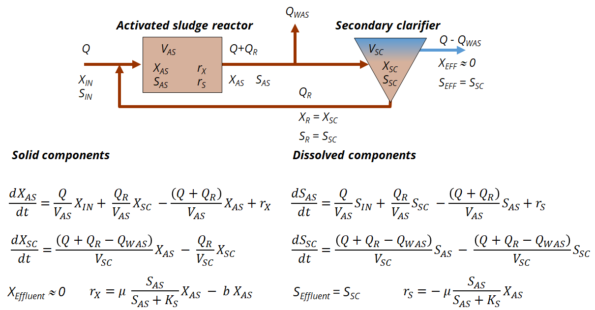

```{css, echo = FALSE}
.shiny-frame{height: 2000px;}
```  

```{r, echo=FALSE, message=FALSE}
library(deSolve)
library(shinyjs)

# Example for integration of ODE in shiny application

# Markus Ahnert, Technische Universität Dresden, Institut für Siedlungs- und Industriewasserwirtschaft
# markus.ahnert@tu-dresden.de

```
  

### Description
Wastewater treatment plants consist of at least an activated sludge reactor for (biological) processes and a (secondary) clarifier for liquid-solid separation. Therefore, a separate mass balance equation must be established for each reactor. In addition, dissolved and particulate substances must be considered differently.
While dissolved substances are present in the secondary clarifier both in the effluent and in the return sludge, by definition no solids are found in the effluent. This results in a different mass balance equation for the solids.
  
   

  
&NewLine;  
  
The volume of both reactors is assumed to be constant.
For reasons of simplification, the excess sludge is also removed from the aeration tank. This has the mathematical advantage that the required quantity of sludge can be calculated very easily by specifying a sludge retention time SRT.
Two processes are active: growth and death of biomass. Substrate is consumed during growth and released again during death. A Monod function is used to limit growth in the absence of substrate. There is also an app for Monod function calculations available.
  
&NewLine;    

```{r shiny_bsp1, echo=FALSE}

# define ODE function
ASM_simple_ode <- function(t, state, params) {
  with(as.list(c(state, params)), {

    S_AS <- state[1]
    S_SC <- state[2]
    X_AS <- state[3]
    X_SC <- state[4]
    
    # variables    
    Q_WAS <- min(V_AS/SRT, Q*0.99999) # it needs to be Q_WAS < Q otherwise no return sludge and effluent is available
    Q_R <- Q
    V_SC <- V_AS/1000 # SC is only for solids separation
    
    # process rates
    rX <- mu*S_AS/(S_AS+Ks)*X_AS - b*X_AS
    rS <- -mu*S_AS/(S_AS+Ks)*X_AS
    
    # ODEs
      dS_AS <- Q/V_AS*Sin + Q_R/V_AS*S_SC - (Q+Q_R)/V_AS*S_AS + rS
      dS_SC <- (Q+Q_R-Q_WAS)/V_SC*S_AS - (Q+Q_R-Q_WAS)/V_SC*S_SC
      
      dX_AS <- Q/V_AS*Xin + Q_R/V_AS*X_SC - (Q+Q_R)/V_AS*X_AS + rX
      dX_SC <- (Q+Q_R-Q_WAS)/V_SC*X_AS - Q_R/V_SC*X_SC

    # return derivatives
      list(c(dS_AS,dS_SC,dX_AS,dX_SC))
  })
}

# UTF Codes for greek symbols https://en.wikipedia.org/wiki/Greek_script_in_Unicode

shinyApp(
  
  ui = fluidPage(
    useShinyjs(),
    # Application title
    title="Simple mass balance:",
    id = "form",
fluidRow(
  column(4,
         numericInput(inputId = "Q",
                      label = HTML("influent flow rate Q [m³ d<sup>-1</sup>]:"),
                      value = 10, min=0.001, step=1),
         numericInput(inputId = "Sin",
                      label = HTML("influent substrate conc. [g m<sup>-3</sup>]:"),
                      value = 100, min=0),
         numericInput(inputId = "Xin",
                      label = HTML("influent biomass conc. [g m<sup>-3</sup>]:"),
                      value = 10, min=0),
  ),
  column(4, 
         numericInput(inputId = "mu",
                      label = HTML("growth rate µ [d<sup>-1]:"),
                      value = 10),
         numericInput(inputId = "b",
                      label = HTML("decay rate b [d<sup>-1</sup>]:"),
                      value = 5),
         numericInput(inputId = "SRT",
                      label = HTML("sludge retention time [d]:"),
                      value = 10, min=0.001, step=1),
  ),
  column(4,
         numericInput(inputId = "Ks",
                      label = HTML("half sat. conc. K<sub>s</sub> [g m<sup>-3</sup>]:"),
                      value = 10, min=0.001),
         numericInput(inputId = "S_AS0",
                      label = HTML("initial subtrate conc. S<sub>0</sub> [g m<sup>-3</sup>]:"),
                      value = 0, min=0),
         numericInput(inputId = "X_AS0",
                      label = HTML("initial biomass conc. X<sub>0</sub> [g m<sup>-3</sup>]:"),
                      value = 10, min=1),
         
         # Leeres Label für Ausrichtung
         div(style = "margin-top: 40px;",
             actionButton("resetAll", "Reset all")
            )
         
  ),
  plotOutput("ConcPlot1"),
  
)

),  
  server = function(input, output) {

observeEvent(input$resetAll, {
  reset("form")
})
        
plots <- reactive({

t_start = 0 # start time
t_end = 50 # end time
t_points = seq(t_start, t_end, by = 0.1) # time points for solution

# model parameters
params <- c(V_AS=10, Q=input$Q, Sin=input$Sin, Xin=input$Xin, mu=input$mu, b=input$b, SRT=input$SRT, Ks=input$Ks)

# initial states
state_0 <- c(S_AS=input$S_AS0,S_SC=input$S_AS0,X_AS=input$X_AS0,X_SC=input$X_AS0) # initial state; same state in AS and SC

# solve system of differential equations
out <- ode(y = state_0, times = t_points, func = ASM_simple_ode, parms = params)
      
# show results
par(mar=c(5,5,5,5))
plot1 <- plot(out, which = c("S_AS", "X_AS"), xlab = "Time [d]", 
              ylab = expression("Concentration [g m"^"-3"*"]"),
              cex.lab=1.5, cex.axis=1.5, cex.main=1.5, cex.sub=1.5)

    # Rückgabe der Plots als Liste
    list(plot1 = plot1)
})

    output$ConcPlot1 <- renderPlot({
      plots()$plot1
    })
  }
  
  
)
```
