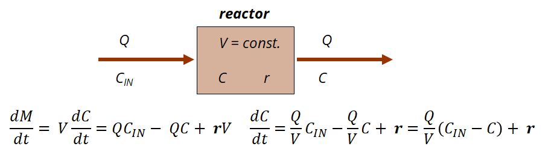

```{css, echo = FALSE}
.shiny-frame{height: 2000px;}
```  

```{r, echo=FALSE, message=FALSE}
library(deSolve)
library(shinyjs)

# Example for integration of ODE in shiny application

# Markus Ahnert, Technische Universität Dresden, Institut für Siedlungs- und Industriewasserwirtschaft
# markus.ahnert@tu-dresden.de

```

  
### Description
Mass balances are the basis for the evaluation and design of all types of processes, especially wastewater treatment plants (WWTPs). For a given system, as in Figure 1 (below), a mass balance consists of all mass flows into and out of the reactor. In addition, several biological or chemical reactions may be active leading to the production or degradation of substances in the reactor.


  
&NewLine;  
  
Depending on the flows around the system, mass balance equations can be written. In this example, there is only one influent and one effluent. A substance with concentration C~IN~ enters the reactor with a constant volume V. Due to its nature as a completely stirred tank reactor (CSTR), the influent concentration C~IN~ is immediately mixed with the effluent concentration C. The rate r describes the process rate based on biological or chemical reactions that lead to a change in concentration (production or degradation, depending on the sign of r).
The general mass balance has 3 terms: one for the influent, one for the effluent and one for the reaction. Because of the constant volume, the equation can be rewritten so that the result of the balance is the change in effluent concentration over time.  


### Model application
The mass balance equation described above is implemented in this application. The reactor has a volume of 10 m³. The following parameters can be changed and the resulting change in model output is plotted directly.
Use this model to answer the questions. Reset to standard values for a new question.
  
* How does the concentration dynamics change as the influent flow rate changes? Can you explain why?
* What value of process rate is required for complete degradation of substrate C? Can you explain why? Now change the influent concentration! What happens? Can you explain why?
* How can you get a negative effluent concentration? This is not possible in reality - but why is it possible in our model?
  
&NewLine;  

```{r shiny_bsp1, echo=FALSE}

# define ODE function
ASM_simple_ode <- function(t, state, params) {
  with(as.list(c(state, params)), {

    C <- state[1]
    
    # ODEs
      dC <- Q/V*(Cin - C) + r
    # return derivatives
      list(c(dC))
  })
}

# UTF Codes für griechische Symbole https://en.wikipedia.org/wiki/Greek_script_in_Unicode

shinyApp(
  
  ui = fluidPage(
    useShinyjs(),
    # Application title
    title="Simple mass balance:",
    id = "form",
fluidRow(
  column(4,
         numericInput(inputId = "Q",
                      label = HTML("influent flow rate Q [m<sup>3</sup> d<sup>-1</sup>]:"),
                      value = 10, min=0),
         numericInput(inputId = "Cin",
                      label = HTML("influent concentration C<sub>IN</sub> [g m<sup>-3</sup>]:"),
                      value = 100, min=0),
  ),
  column(4, 
         numericInput(inputId = "r",
                      label = HTML("process rate r [g m<sup>-3</sup> d<sup>-1</sup>]:"),
                      value = 10),
  ),
  column(4,
         numericInput(inputId = "C_0",
                      label = HTML("initial concentration C<sub>0</sub> [g m<sup>-3</sup>]:"),
                      value = 0, min=0),

         # Leeres Label für Ausrichtung
         div(style = "margin-top: 40px;",
             actionButton("resetAll", "Reset all")
            )
         
  ),
  plotOutput("ConcPlot1"),
  
)

),  
  server = function(input, output) {

observeEvent(input$resetAll, {
  reset("form")
})
    
plots <- reactive({

t_start = 0 # start time
t_end = 25 # end time
t_points = seq(t_start, t_end, by = 0.1) # time points for solution

# model parameters
params <- c(V=10, Q=input$Q, Cin=input$Cin, r=input$r)

# initial states
state_0 <- c(C=input$C_0) # initial state

# solve system of differential equations
out <- ode(y = state_0, times = t_points, func = ASM_simple_ode, parms = params)
      
# show results
par(mar=c(5,5,5,5))
plot1 <- plot(out, xlab = "Time [d]", ylab = expression("Concentration [g m"^"-3"*"]"),
              cex.lab=1.5, cex.axis=1.5, cex.main=1.5, cex.sub=1.5)

    # Rückgabe der Plots als Liste
    list(plot1 = plot1)
})

    output$ConcPlot1 <- renderPlot({
      plots()$plot1
    })
  }
  
  
)
```
