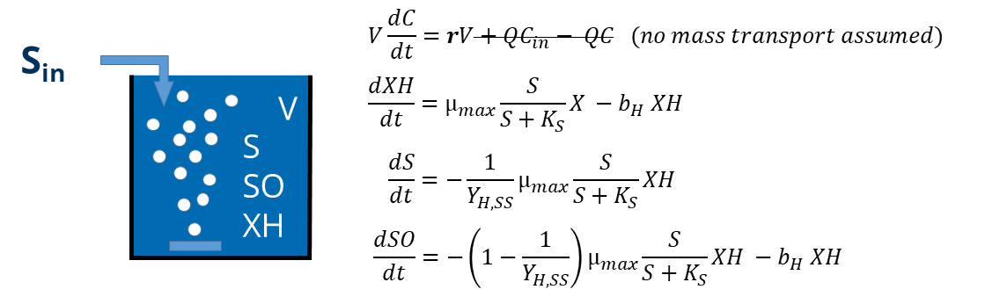

```{r, echo=FALSE, message=FALSE}
library(deSolve)
library(readxl)

# Markus Ahnert, Technische Universität Dresden, Institut für Siedlungs- und Industriewasserwirtschaft
# markus.ahnert@tu-dresden.de

```


### System description
A batch reactor is filled with activated sludge. At different times some readily biodegradable substrate is added. The oxygen uptake rate OUR was measured until all substrate is utilised.
Below you find the model parameters and initial states. Try to calibrate this model manually.


<br>  

### Model practice
The following parameters and initial states can be used to modify the model results. Try to find the sensitive parameters and get a good model fit.

```{r shiny_bsp1, echo=FALSE}

# define ODE function
ASM_simple_ode <- function(t, state, params) {
  with(as.list(c(state, params)), {
    # variables    
     Monod_SS <- SS/(SS+Ks_SS)
     
    # ODEs
      dSO   <- - ((1-1/YH_SS)*(muH*Monod_SS*XH) - bH*XH) # switch to positive with minus
      dSS   <- - 1/YH_SS*     (muH*Monod_SS*XH)
      dXH   <-                 muH*Monod_SS*XH  - bH*XH
    # return derivatives
      list(c(dSO, dSS, dXH),OUR=dSO)
  })
}


# ------- read measurements ---------------------

OUR_ts <-read.csv("our_results.csv", sep = ";") # some measured oxygen uptake rate measurements


yobs <- data.frame(OUR_ts)
      
# some events
eventdat <- data.frame(var = c("SS", "SS", "SS", "SS"),           # relevant model fraction
                       time = c(0.02, 0.08, 0.3, 1) ,             # time in days
                       value = c(220, 440, 880, 220),             # concentration values in g m^-3
                       method = c("add", "add", "add", "add"))    # adding of concentrations

# UTF Codes für griechische Symbole https://en.wikipedia.org/wiki/Greek_script_in_Unicode

```


```{r, echo = FALSE}
## run pure R version of the model
simulate <- reactive({
t_start = input$t_start # start time
t_end = input$t_end # end time
t_points = seq(t_start, t_end, by = 0.005) # time points for solution

# model parameters
params <- c(YH_SS=input$YH_SS, muH=input$muH, Ks_SS=input$Ks_SS, bH=input$bH)

# initial states
state_0 <- c(SO = 0, SS=input$S_0, XH=input$X_0) # initial state

# solve system of differential equations
out <- ode(y = state_0, times = t_points, func = ASM_simple_ode, parms = params, events = list(data = eventdat))
})
```


```{r, echo=FALSE}
renderPlot({
  out <- simulate()
  par(mar = c(5, 5, 5, 5))  # <<<<<< WICHTIG  

  plot(out, obs = yobs, xlab = "Time [d]", ylab = expression(Respiration~rate~(OUR)~"["*g~m^-3~d^-1*"]"), main="Respiration rate of all processes")      
  legend("topright",
         legend = c("modelled", "measured"),
         lwd = 1,
         lty=c(1,0),
         bty="n",
         pch=c(NaN,1)
         )
})
```

```{r, echo=FALSE}
obj1 <-  verticalLayout(
  h4("Model parameters:"),
          numericInput(inputId = "muH",
                       label = HTML("max. growth rate of biomass \u03BC<sub>max</sub> [d<sup>-1</sup>]:"),
                       width = "100%", value = 2, min=0,step=0.1),
          numericInput(inputId = "YH_SS",
                       label = HTML("Yield Y<sub>H,SS</sub> [-]:"),
                       width = "100%",value = 0.8, min=0,max=1,step=0.1),
          numericInput(inputId = "Ks_SS",
                       label = HTML("half saturation conc. Ks<sub>SS</sub> [g m<sup>-3</sup>]:"),
                       width = "100%",value = 20, min=0),
          numericInput(inputId = "bH",
                       label = HTML("end. respiration rate b<sub>H</sub> [d<sup>-1</sup>]:"),
                       width = "100%",value = 0.2, min=0,step=0.05))
obj2 <-  verticalLayout(
  h4("Initial values:"),
          numericInput(inputId = "S_0",
                       label = HTML("initial substrate conc. S<sub>0</sub> [g m<sup>-3</sup>]:"),
                       width = "100%",value = 0, min=0),
          numericInput(inputId = "X_0",
                       label = HTML("initial biomass conc. X<sub>0</sub> [g m<sup>-3</sup>]:"),
                       width = "100%",value = 1200, min=0))
obj3 <-  verticalLayout(
  h4("Simulation period:"),
          numericInput(inputId = "t_start",
                       label = HTML("start time [d]:"),
                       width = "100%",value = 0, min=0),
          numericInput(inputId = "t_end",
                       label = HTML("end time [d]:"),
                       width = "100%",value = 2, min=0),
   )

fluidPage(
fluidRow(
  column(4,obj1),
  column(4,obj2),
  column(4,obj3)
))

server = function(input, output) {

observeEvent(input$resetAll, {
  reset("form")
})
}  
```

<br>
This plots show the dynamics of all state variables of the model. 
Remark: The oxygen is only modelled for OUR calculation and the state variable SO shows accumulated consumed oxygen.


```{r, echo=FALSE}

renderPlot({
  out <- simulate()
  plot(out, xlab = "Time [d]", ylab = "Concentration [g m-3]")
})
```
