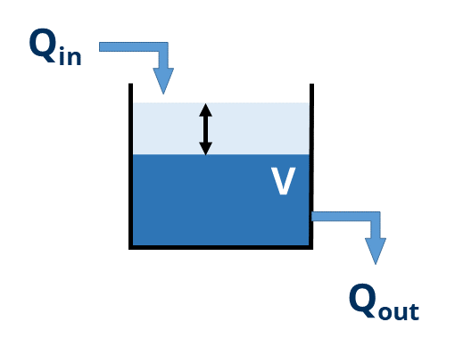

```{css, echo = FALSE}
.shiny-frame{height: 2000px;}
```  

```{r, echo=FALSE, message=FALSE}
library(deSolve)
library(readxl)
library(shinyjs)

# Markus Ahnert, Technische Universität Dresden, Institut für Siedlungs- und Industriewasserwirtschaft
# markus.ahnert@tu-dresden.de

# =======
# Model for calculation of transport phenomena around a water storage tank 
# =======


# https://www.youtube.com/watch?v=BtWQ4Kk1opg Tutorial for theoretical considerations regarding effluent calculation
```


### Motivation

This interactive Shiny app demonstrates the dynamic behavior of a simple **water tank with delayed, nonlinear discharge**.
It is suitable, for example, for clearly explaining storage processes, mass balances, and nonlinear discharge behaviour.

------------------------------------------------------------------------

### Model assumptions

We have a tank with a volume $V(t)$ with following conditions:

-   constant influent $Q_{in}$
-   start of effluent at a certain time $t_{start}$
-   nonlinear behaviour of effluent discharge

{width=30%}


This results in the following ordinary differential equation for calculation of volume dynamics in the tank:
$$
\frac{dV}{dt} = Q_{in} - Q_{out}
$$

with

$$
Q_{out} = \begin{cases}
0 & t < t_{start} \\
k \sqrt{V} & t \ge t_{start}
\end{cases}
$$

------------------------------------------------------------------------

### Model implementation

The model formulated as ODE function contains the conditions and equations from above. The result are the derivative of the volume and the resulting effluent discharge. 

```{r model, echo=TRUE}
tank_model <- function(t, state, parms) {
  with(as.list(c(state, parms)), {

    Qout <- if (t >= t_start) k * sqrt(max(V, 0)) else 0 # condition for effluent starting at time t_start
    dVdt <- Qin - Qout                                   # ODE for volume calculation

    list(c(dVdt), Qout = Qout) # returning results of the function
  })
}
```


```{r simulation, echo=FALSE, message=FALSE}
tank_sim <- reactive({

  parms <- c(Qin     = input$Qin,
             k       = input$k,
             t_start = input$t_start)

  state <- c(V = input$V0)

  times <- seq(0, 20, by = 0.1)

  out <- ode(y = state,
             times = times,
             func = tank_model,
             parms = parms)

  as.data.frame(out)
})
```

------------------------------------------------------------------------

### Model application

The following plot shows the temporal progression of the tank volume and the outflow.

- Until time $t_{start}$, the volume increases linearly because there is no outflow.
- After that, a nonlinear outflow begins, which depends on the current volume.
- In the long term, a steady state is reached when the inflow and outflow are equal.

------------------------------------------------------------------------

### Model parameters

```{r inputs, echo=FALSE, message=FALSE}
fluidRow(
  column(6,sliderInput(
      "Qin","Influent flow rate Q_in [m³ h⁻¹]",
      min = 0, max = 5, value = 1, step = 0.25
    )
  ),
  column(6,sliderInput(
      "k","Effluent coefficient k [h⁻¹]",
      min = 0.0, max = 5, value = 2, step = 0.05
    )
  )
)

fluidRow(
  column(6,sliderInput(
      "t_start","Time of start of effluent t [h]",
      min = 0, max = 10, value = 3, step = 0.5
    )
  ),
  column(6,numericInput(
      "V0","Volume at t = 0 h V₀ [m³]",
      value = 1, min = 0
    )
  )
)


```

```{r server, server=TRUE, echo=FALSE, message=FALSE}
output$tankPlot <- renderPlot({
  df <- tank_sim()

  par(mar = c(5, 4, 4, 6))  # <<<<<< WICHTIG  
  
  plot(df$time, df$V,
       type = "l",
       lwd = 2,
       col = "blue",
       xlab = "time [h]",
       ylab = "Volume V [m³]")

  par(new = TRUE)

  plot(df$time, df$Qout,
       type = "l",
       lwd = 2,
       lty=5,
       col = "black",
       axes = FALSE,
       xlab = "",
       ylab = "")

  axis(side = 4, col = "black", col.axis = "black")
  mtext(expression(paste("Effluent Q"[out], " [m"^3, " h"^-1, "]")),
      side = 4, line = 3, col = "black")
  legend("topright",
         legend = c("Tank volume", "Effluent flow rate"),
         col = c("blue", "black"),
         lwd = 2,
         lty=c(1,5),
         bty = "n")
})


```

```{r ui, echo=FALSE, message=FALSE}
plotOutput("tankPlot", height = "450px")
```

------------------------------------------------------------------------

###  Notes

-   Before $t_{start}$, the system corresponds only to storage.
-   After $t_{start}$, a steady state is reached when $Q_{in} = Q_{out}$.
-   The model is mathematically simple, but exhibits typical characteristics of real drainage systems.
